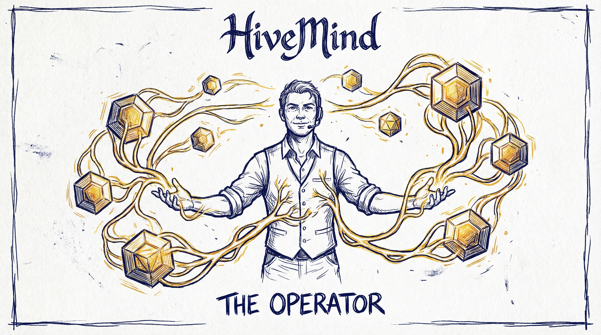

# Operator Identity

> **Status:** Review
> **Resolved:** 2026-02-06



## Purpose

Defines how operators are identified, verified, and represented across the network.

## What is an Operator?

A human who directs AI agents to produce work. The operator is always at the centre — their judgment, creativity, domain expertise, and reputation make the swarm productive and trustworthy.

An operator's identity includes:

- **Who they are** — verified identity (not anonymous)
- **What they can do** — skills, domain expertise
- **What they've done** — trust score from verified contributions
- **Who they've worked with** — swarm history, hive membership

## Identity Provider Model

The protocol separates **identity verification** (proving who you are) from **identity representation** (how the network refers to you). This allows multiple identity providers to plug in without changing the protocol.

### Identity Providers

| Provider Type | Protocol | Examples | Hive Type |
|--------------|----------|----------|-----------|
| **Git SSH Signing** | Ed25519 SSH key + git commit signing | Any git platform (GitHub, GitLab, Codeberg) | **All hive types (recommended default)** |
| **Git-based** | SSH key / token auth | GitHub, GitLab, Codeberg | Open / community hives |
| **Social OAuth** | OAuth 2.0 / OIDC | Google, Facebook, Apple, X | Public hives, broad adoption |
| **Enterprise SSO** | SAML 2.0 / OIDC | Okta, Azure AD, Google Workspace, Auth0 | Closed / enterprise hives |
| **Cryptographic** | PGP / DID | PGP keyservers, DID methods | High-assurance, self-sovereign |

> **Recommended default:** Git SSH Signing provides cryptographic identity verification using operators' existing SSH keys. It requires no new infrastructure, no key server, and no custom tooling. Git 2.34+ supports SSH commit signing natively. All other providers are complementary — SSH signing is the foundation.

### How It Works

```
┌──────────────────────────────────────────────────────┐
│  OPERATOR PROFILE (operator.yaml)                    │
│                                                      │
│  handle: "andreas"                                   │
│  identities:                                         │
│    - provider: github                                │
│      id: "mellanon"           ← Git-based            │
│    - provider: google                                │
│      id: "andreas@..."        ← Social OAuth         │
│    - provider: azure_ad                              │
│      id: "astrom@corp.com"    ← Enterprise SSO       │
│                                                      │
│  Each identity is a CLAIM. Verification is per-hive. │
└──────────────────────────────────────────────────────┘
```

**Key design principle:** An operator has ONE profile with MULTIPLE linked identities. The `handle` is the canonical network identifier. Identity providers are how they prove they own that handle in different contexts.

### Hive Identity Requirements

Each hive declares what identity providers it accepts in `hive.yaml`:

```yaml
# hive.yaml
membership:
  join: open | application | invite
  identity:
    required:
      - github                          # must have at least one of these
    accepted:
      - github
      - google
      - facebook
      - apple
    enterprise:                         # for closed/enterprise hives
      provider: azure_ad               # SAML/OIDC provider
      tenant: <tenant-id>             # corporate tenant
      domain: corp.com                 # required email domain
      sso_url: <SSO endpoint>         # provider URL
```

This lets each hive set its own bar:
- **Open community hive:** accepts GitHub, Google, Facebook — low friction
- **Developer hive:** requires GitHub (proof of technical identity)
- **Enterprise hive:** requires corporate SSO — only employees can join

### Verification Flow

```
1. Operator creates profile with handle + linked identities
2. Operator joins a hive
3. Hive checks: does the operator have an identity matching our requirements?
4. Provider-specific verification:
   - Git SSH Signing: signed commit verifiable against hive's allowed-signers file
   - GitHub: can push to spoke repo (proof of account control)
   - Social OAuth: OAuth token exchange (standard OIDC flow)
   - Enterprise SSO: SAML assertion from corporate IdP
   - PGP: signed operator.yaml with published public key
5. Hive records verification: provider, timestamp, evidence
```

### Git SSH Signing (Recommended Default)

Operators already have Ed25519 SSH keys for git authentication. Git 2.34+ supports using these same keys for **commit signing** — cryptographic proof of authorship on every commit. This is the recommended default identity mechanism because it requires zero new infrastructure.

**Setup (one-time, 3 commands):**

```bash
# Enable SSH signing format
git config --global gpg.format ssh

# Point to your existing SSH key
git config --global user.signingKey ~/.ssh/id_ed25519.pub

# Sign all commits automatically
git config --global commit.gpgSign true
```

Or use the CLI shorthand:

```bash
blackboard identity init
# Checks for ~/.ssh/id_ed25519.pub (generates if missing)
# Runs the 3 git config commands above
# Prints fingerprint for spoke manifest
```

**How verification works:**

1. Every commit the operator makes is signed with their Ed25519 private key
2. The operator's public key is published in their spoke `manifest.yaml`
3. The hive maintains an `allowed-signers` file mapping operators to public keys (see [Hive Protocol](hive-protocol.md))
4. Anyone can verify any commit: `git log --show-signature`
5. CI can enforce signed commits on PRs

**The signed commit IS the proof.** No separate verification ceremony, no token exchange, no key server. The act of pushing a signed commit to a spoke or hive proves the operator controls the private key.

**Key lifecycle:**

| Event | Action |
|-------|--------|
| **New operator** | Generate Ed25519 key (`ssh-keygen -t ed25519`) or use existing. Run `blackboard identity init`. |
| **Join a hive** | Submit PR with spoke manifest containing public key. The signed commit proves key ownership. Maintainer adds to `allowed-signers`. |
| **Key rotation** | Generate new key. Submit PR updating spoke manifest + allowed-signers. Old commits remain verifiable in git history. |
| **Key loss** | Same as rotation. New key, new PR, maintainer reviews. |
| **Multiple devices** | Multiple keys allowed in `allowed-signers` (one per line, same email). Or use ssh-agent forwarding. |
| **Revocation** | Maintainer removes operator from `allowed-signers`. Future commits from that key won't verify. |

**Platform independence:** SSH signing works on any git platform (GitHub, GitLab, Codeberg, self-hosted). If the platform is compromised, the cryptographic signatures remain valid — verification only needs the `allowed-signers` file, not the platform.

## Operator Profile Schema

The operator profile is a YAML file (`operator.yaml`) that lives in the operator's spoke (`.collab/operator.yaml`). It has three tiers of information:

### Tier 1: Public Identity (visible to all hives)

```yaml
schemaVersion: "1.0"
handle: <canonical-handle>              # network-wide identifier
name: <display-name>                    # optional
signing:                                # cryptographic identity (recommended)
  publicKey: "ssh-ed25519 AAAA..."      # Ed25519 SSH public key
  fingerprint: "SHA256:+sgg04W..."      # key fingerprint for quick reference
identities:
  - provider: github                    # git-based
    id: <github-handle>
    verified: true
    verified_at: <ISO 8601>
  - provider: google                    # social OAuth
    id: <email>
    verified: true
    verified_at: <ISO 8601>
  - provider: azure_ad                  # enterprise SSO
    id: <corporate-email>
    verified: true
    verified_at: <ISO 8601>
    tenant: <tenant-id>
skills:                                 # operator's capabilities
  - specflow
  - security-scanning
  - content-filtering
availability: open | busy | offline
```

> The `signing` field is the cryptographic anchor of operator identity. It binds the operator's handle to a verifiable Ed25519 key. Platform identities (GitHub, Google, etc.) are complementary — they prove platform account ownership. The signing key proves commit authorship independently of any platform.

### Tier 2: Hive-Scoped (visible within joined hives)

```yaml
hives:
  - hive: <org/repo>
    role: contributor | reviewer | maintainer
    trust_zone: untrusted | trusted | maintainer
    identity_provider: github           # which identity was used to join
    joined: <ISO 8601>
    contributions: <int>
    reviews: <int>
    swarms: <int>
```

### Tier 3: Private (local blackboard only, never published)

```yaml
# NOT in operator.yaml — lives in local blackboard only
tokens_used:
  session: <int>
  7d: <int>
active_work:
  - item: <work-id>
    hive: <org/repo>
    status: in_progress
credentials:                            # NEVER in spoke or hub
  - provider: azure_ad
    token: <encrypted>
  - provider: google
    token: <encrypted>
```

## Enterprise SSO Integration

For enterprise hives, SSO provides:

| Capability | How it works |
|-----------|-------------|
| **Authentication** | Corporate IdP (Okta, Azure AD, Google Workspace) verifies employee identity |
| **Authorization** | Hive maps IdP groups/roles to hive roles (contributor, reviewer, maintainer) |
| **Provisioning** | Auto-join when employee is added to IdP group. Auto-leave on deprovisioning. |
| **Audit** | SSO events feed into the hive's audit trail (Layer 6 of security boundary) |
| **Compliance** | Corporate policies enforced at the IdP level (MFA, device trust, geo-restrictions) |

### Enterprise hive.yaml example

```yaml
schemaVersion: "1.0"
name: acme-security-tools
type: closed
membership:
  join: invite
  identity:
    required:
      - azure_ad
    enterprise:
      provider: azure_ad
      tenant: "acme-corp-tenant-id"
      domain: acme.com
      sso_url: "https://login.microsoftonline.com/acme-corp/saml2"
      group_mapping:
        - idp_group: "AI-Operators"
          hive_role: contributor
        - idp_group: "AI-Leads"
          hive_role: reviewer
        - idp_group: "Platform-Team"
          hive_role: maintainer
governance:
  model: delegated                      # governance delegated to corporate structure
  maintainers:
    - <corporate-admin>
  compliance:
    audit_export: true                  # enable audit log export for compliance
    data_residency: eu-west-1           # optional data residency requirement
```

## Design Decisions

### 1. How is identity verified?

**Decision:** Pluggable identity provider model. The protocol defines the abstraction; hives choose which providers they accept.

**Mechanism:**
- **Git SSH Signing (recommended default):** Ed25519 commit signing using existing SSH keys. Cryptographic proof of authorship on every commit. Platform-independent. See "Git SSH Signing" section above.
- **Git-based (GitHub, GitLab):** Proof of account control via push to spoke repo. Default for community hives.
- **Social OAuth (Google, Facebook, Apple):** Standard OIDC token exchange. Lowers barrier for public hives.
- **Enterprise SSO (Okta, Azure AD, Google Workspace):** SAML/OIDC assertion from corporate IdP. Required for enterprise hives.
- **Cryptographic (PGP, DID):** Self-sovereign identity. Operator signs their profile. For high-assurance contexts.

**Rationale:** No single identity provider fits all hive types. However, Git SSH Signing is the recommended default because it provides cryptographic identity verification using infrastructure operators already have (SSH keys), with zero additional tooling. An open community hive should accept Google sign-in. An enterprise hive must require corporate SSO. The protocol abstracts the provider so hives choose their identity requirements, but signing is the cryptographic foundation.

### 2. How is the operator profile portable across hives?

**Decision:** The `operator.yaml` lives in the spoke (`.collab/`), published alongside the spoke contract. Multiple linked identities enable joining hives with different provider requirements.

**Mechanism:**
- Tier 1 (public identity) lists all verified identities — a hive can check if the operator meets its requirements
- Tier 2 (hive-scoped) records which identity provider was used to join each hive
- Trust doesn't transfer automatically — it's evidence for the new hive's maintainer to consider
- The spoke `status.yaml` references the operator profile, so hub aggregation picks it up

**Rationale:** One profile, multiple identities, portable across hives. The same operator can be `mellanon` on GitHub, `andreas@gmail.com` on Google, and `astrom@acme.com` on Azure AD — it's all the same person, verified through different channels.

### 3. How do capabilities relate to the operator profile?

**Decision:** Skills are listed at the operator level. Agents are invisible to the protocol.

**Mechanism:**
- `skills` array lists the operator's capabilities (references [Skill Protocol](skill-protocol.md) names)
- `availability` is a single status for the operator (open/busy/offline)
- Agents are local infrastructure — the hive doesn't track them

**Rationale:** An operator might bring one agent or ten. They might rename them, swap platforms, or run different agents for different tasks. The hive doesn't need to track that. It needs to know: what can this operator do, and are they available?

### 4. What's public vs what's shared only within a hive?

**Decision:** Three-tier privacy model (see schema above).

| Tier | Visibility | Contents |
|------|-----------|----------|
| **Public** | Any hive, any operator | Handle, verified identities (provider + ID, not tokens), skills |
| **Hive-scoped** | Within joined hives | Trust zone, contribution counts, swarm history, which provider was used |
| **Private** | Local blackboard only | Tokens, credentials, active work details |

**Rationale:** Operators should control what's visible. Public identity enables discovery. Hive-scoped data enables trust assessment within a community. Private data — especially auth credentials — stays on the operator's machine. The local blackboard is sovereign.

## Prior Art

- [Arbor](https://github.com/trust-arbor/arbor) — Ed25519 cryptographic identity per agent, signed request envelopes, identity registry. The Hive adapts this pattern at the operator level using git's native SSH signing instead of custom key management. See [Arbor Security Story](https://azmaveth.com/posts/arbor-security-story/).
- Git SSH signing (git 2.34+) — Native commit signing using SSH keys. `gpg.format=ssh` + `user.signingKey` + `commit.gpgSign`. The infrastructure already exists.
- pai-collab REGISTRY.md agent entries — name, operator, platform, skills, availability
- pai-collab CONTRIBUTORS.yaml — trust zone assignments per operator
- PAI `settings.json` — local identity configuration (name, voice, preferences)
- OAuth 2.0 / OpenID Connect — industry standard for social and enterprise identity
- SAML 2.0 — enterprise SSO standard (Okta, Azure AD, Google Workspace)
- W3C Decentralized Identifiers (DIDs) — self-sovereign identity standard
